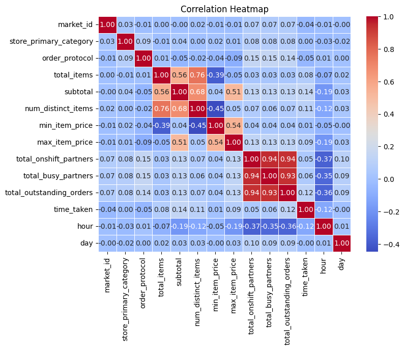

# Handling missing values:
### 1. Imputation:

Fill in the missing values with a calculated or estimated value. This could be the mean, median, or mode of the existing values in the column.
python
Copy code
```python
# Example: Impute with the mean
mean_value = df['total_outstanding_orders'].mean()
df['total_outstanding_orders'].fillna(mean_value, inplace=True)
```
### 2. Forward Fill or Backward Fill:

Use the values from the previous or next row to fill in the missing values. This is especially useful when dealing with time-series data.
python
Copy code
```python
# Example: Forward fill
df['total_outstanding_orders'].fillna(method='ffill', inplace=True)
```
### 3. Interpolation:

Use interpolation methods to estimate missing values based on the values of neighboring data points.
python
Copy code
```python
# Example: Linear interpolation
df['total_outstanding_orders'].interpolate(method='linear', inplace=True)
```
### 4. Drop Rows:

If the missing values are limited and do not significantly impact the analysis, you might choose to simply remove the rows with missing values.
python
Copy code
```python
# Example: Drop rows with missing values
df.dropna(subset=['total_outstanding_orders'], inplace=True)
```
### 5. Advanced Imputation:

Explore more advanced imputation techniques, such as using machine learning algorithms to predict missing values based on other features in the dataset.
Remember to carefully consider the nature of your data and the potential impact of each strategy on your analysis. It's often a good practice to document the chosen approach and reasoning behind handling missing values in your dataset.

# correlation matrix

The correlation matrix is a table that shows the correlation coefficients between many variables in a dataset.

def - *Correlation coefficients quantify the strength and direction of the linear relationship between two variables. The values range from -1 to 1,* 
where:
  - (1) indicates a perfect positive linear correlation,
  - (-1) indicates a perfect negative linear correlation,
  - (0) indicates no linear correlation.
By calculating the correlation matrix, you can quickly understand how different variables in your dataset are related to each other. This is valuable for various data analysis tasks, such as:

1. Identifying Relationships: You can identify which variables have strong positive or negative relationships. For example, if the correlation coefficient between two variables is close to 1, it suggests a strong positive correlation, and if it's close to -1, it suggests a strong negative correlation.

1. Multicollinearity: In the context of regression analysis, high correlation between independent variables might indicate multicollinearity. Multicollinearity can affect the stability and interpretability of the regression coefficients.

1. Feature Selection: In machine learning, you might use the correlation matrix to identify and remove highly correlated features, reducing redundancy in your feature set.

1. Data Exploration: Exploring the correlation matrix can provide insights into the structure of the data and guide further analysis.
```python
# Calculate the correlation matrix
correlation_matrix = df.corr()

# Create a heatmap with correlation values
plt.figure(figsize=(8, 6))
sns.heatmap(correlation_matrix, annot=True, cmap='coolwarm', fmt=".2f", linewidths=.5)
plt.title('Correlation Heatmap')
plt.show()
```


